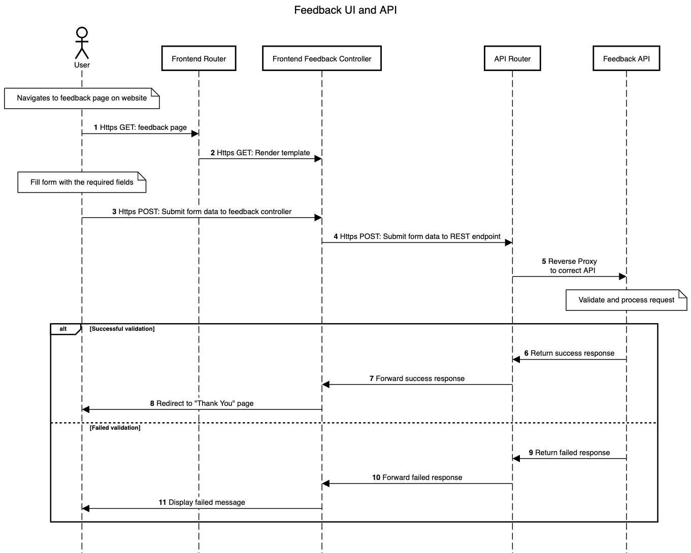

# Feedback Service Architecture

Source of truth for the application architecture of the ONS feedback service.

## Contents

- [Feedback Service Architecture](#feedback-service-architecture)
  - [Contents](#contents)
  - [Feedback and upstream services](#feedback-and-upstream-services)
    - [Feedback UI and API](#feedback-ui-and-api)
    - [Upstream service and API](#upstream-service-and-api)
  - [Sequence diagrams](#sequence-diagrams)

## Feedback and upstream services

### Feedback UI and API

Feedback dataflow from users on the website submitting a valid feedback form and receiving a successful response from the API.

### Upstream service and API

Upstream service dataflow from users on an upstream service interacting with the feedback footer, submitting a valid feedback form and receiving a successful response from the API.

## Sequence diagrams

To update the diagrams, see [sequence diagrams documentation](sequence-diagrams/README.md)
